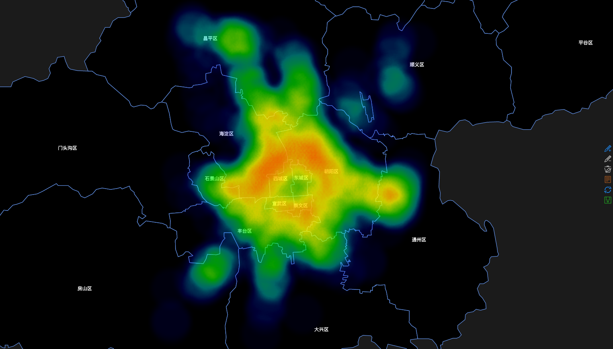

#Introduce, Opinions on Data Science

##What is data science?

Many definitions have been made to data science since it’s such a young subject of science. Simply from its name “Data Science”, data science is a subject that about data’s science or research data, tying to research data as a “Natural Object”. So, data science is defined as the theory, method and technique to research data.

\begin{itemize}
\item Explore and research data itself, research its various types, status, attributes, change forms and changing patterns.
\item Offer a new method called data method for scientific research to the research of natural science and social science, aimed to reveal and to explain nature and human behavior phenomena and its pattern.
\end{itemize}

There’s a common misunderstanding here: that is, many people think that data science is only used to study data itself, not as a research method or a tool to discover new knowledge. The premise of data science to become a science is that the relationship and patterns found in a certain field have universal applicability that can be extended to other fields, not just a tool for some specific fields.
Data science is all about how we take data, use it to get knowledge, and then use the knowledge to do the following things [2]:

\begin{itemize}
\item Make decisions
\item Predict the future
\item Understand the past / future
\item Create new industry / products
\end{itemize}

So, this is my favorite definition to data science:
Data science is the art and science of acquiring new knowledge through data.

##Why data science?

At present time, there’s no doubt that we have an amazingly huge amount of data. And here comes the “Big Data”. Though its definition is vague, but there are four widely accepted features: Volume, Velocity, Variety and Value [3]. In addition to the value, the remaining three characteristics determined that big data is difficult to work with [4].:
	
\begin{itemize}
\item Data volume can be up to PB, EB or even ZB sized, for example, dozens of data can be made by a midsized city’s surveillance cameras.
\item The reality puts forward higher requirements for the processing speed of data, that is, the real-time requirement of collecting data, and the need to integrate data into business processes and decision-making processes, all this reflected the difference from traditional data processing.
\item The type and structure of data is completed. in the past, the data we made or process is mostly structured, but now more and more new technology is producing many unstructured data such as XML, blog and instant messages [5].
\end{itemize}

Because of these, big data is usually difficult to be used directly and efficiently, and the very main goal of data science is to develop clear practices and procedures for faster and more efficient use of big data.

##What do data scientists do?

It’s widely said that data scientists are the sexiest job of the 21st century. As a possible future career, it is necessary for us to understand what exactly data scientists do. A complete data science project requires many people to work together, and data scientists are an important part of it. They are responsible for performing the steps necessary to succeed in the project, including designing project steps, selecting data sources and tools used, and be responsible for project planning. On the technical side, they need to be good in statistics and machine learning, to examine data, perform statistical test and processing; use machine learning models, and evaluate results. These are also the daily tasks of a data scientist.

##What can data science do?

As we mentioned earlier, data science can describe, generalize, abstract data, and make predictions for the real world to help people making decisions. But specifically, what exactly can it do? There are some examples I found.

###Public opinion forecast for Obama campaign

The Obama administration is an active promoter of the big data and data science boom. In November 2012, Obama defeated rival Romney and successfully re-elected the president. One of the secrets of his successful re-election is the data analysis team he calls "core code."
The key to win is to get support from more voters. His team has stored a large amount of voter information, and they use this information to dig out propaganda strategies for different voter groups to make promotion more efficient.
Different from the past, the Obama team abandoned the strategy of deciding the advertising based on the opinions of media consultants, but built his advertising strategy on a large database they own. The result of advertising in Chicago showed that TV advertising efficiency increased by 14% [6].
Obviously, Obama's wining reflects the advance of data analysis, because the storage, analysis and processing power of big data is the basis of macro decision-making and the key to gaining information in advance.

###Intelligent Transportation in Los Angeles, USA

With big data and data analysis, transportation system can become more efficient and smarter. By the analysis of real-time monitoring data, an intelligent transportation system can achieve real-time analysis and prediction of traffic conditions, traffic path planning and many other aspects.
In Los Angeles, for example, since the 1989 Olympics, the government has built an automatic traffic monitor and control center. By using data analysis, they developed an adaptive traffic control system that automatically adjusts the signal time based on the traffic volume, reducing vehicle waiting time. Other than this, combined with a large amount of data, the system can increase the average traffic speed by 12% for the intersections in Los Angeles and reduce the waiting time by 30% [7].
Through these examples, we can clearly see that big data combined with data analysis can affect many aspects of society, make government activities more efficient, make society more convenient, etc. Data science is making our lives easier. Better.

##New technologies for data science

Big data brings opportunities and challenges to data science. Traditional data processing methods have been unable to meet the needs of big data. In recent years, the rapid development of a new generation of technologies, such as bath towel computing, Internet of Things, mobile Internet, etc., has provided greater opportunities and development conditions for data collection, storage and processing.

###Cloud Computing

Today, data scientists can use many open source machine learning frameworks such as R, SciKit Learn, Spark MLlib, TensorFlow, MXnet, and CNTK. However, managing the configuration and environment of these frameworks on a laptop or local server can be bothering and can take a lot of unnecessary time.
In the age of cloud computing, that unnecessary time consume will be greatly reduced. The usage-based pricing model for cloud computing is very effective for machine learning. Cloud computing also makes it easier to explore different machine learning frameworks, with cloud computing sellers offering model hosting and deployment options. In addition, public cloud computing service providers offer smart capabilities as a service, and this reduces the barriers to integrating these features into new products or applications.

###Machine Learning

The core of timely and automated processing of data is often algorithms. With the breakthrough development of deep learning technology, machine learning algorithms can be developed at a high speed. In short, the intelligence of big data processing must be machine learning and deep learning.
In recent years, machine learning algorithms are having a rapid development, and various networks and algorithms have emerged one after another. For example, BERT, vid2vid, graph_nets. The BERT paper published by Google AI in October has aroused strong concern in the deep learning community. This paper presents a deep two-way Transformer model. BERT has refreshed the best performance of 11 NLP tasks, including the Stanford Q&A data set (SQuAD). And NVIDIA's Video-to-Video (vid2vid) synthesis paper introduces an amazingly productive model that has been one of the most popular deep learning areas of the past few years.

##Future development of data science

In the age of big data, the size, flexibility, and the ability to collect and use information that a company have will determine their core competencies. Data will become the key asset of the company. Owning the data is owning the market, which means a huge return on investment. Companies with data and data science thinking mode are creating new business models.
The following are some of my personal view on the development of data science in the age of big data:

###The application of data science will move from the Internet to traditional industry applications

With the increase of big data and the spread of data thinking, more and more industries and companies will realize that data and information will become assets and resources, and data analysis and processing capabilities will bring bigger benefits to companies. And with the advancement of enterprise information and the popularize of Internet service models, traditional industries will become more and more accessible to and apply big data and data analysis [8].

###Data services will be more industrialized

With the popularize of big data and the Internet, the demand for data analysis in various industries is getting bigger, and there will be higher requirements for data analysis [9]. As a result, more companies will turn to data services for the industry. Third-party data services will become a direct way of profit, such as selling raw data, selling analyzed results, or collecting, processing, analyzing, and delivering value to form the data chain to help cooperative company to form core competitiveness. More and more companies are turning to such data services.


#Brief Introduction to Two Data Sets and Views on Public Data

##Chicago criminal record from 2001 to the present

This dataset reflects reported incidents of crime that occurred in the City of Chicago from 2001 to present.
There are samples from data:
```{r}
library(knitr)
data_crime <- read.csv("../crimes.csv")
kable(data_crime[1:5,1:3],caption="Chicago criminal record")
kable(data_crime[1:5,4:7])
kable(data_crime[1:5,8:14])
kable(data_crime[1:5,15:20])
kable(data_crime[1:5,21:24])
kable(data_crime[1:5,25:29])
```
This data set was collected and published by the goverment of city of Chicago, including detailed criminal records, crime time, location, processing information, and penalties, and was processed as needed for further analysis.
The Chicago police conducted extensive analysis of these data, for example, to explore patterns of behavior between crimes and crime sites, and analysis of crime types based on time. Based on the above data analysis, the Chicago police carried out a large number of crime prevention work, which greatly reduced the incidence of crimes and reduced the harm caused by crime.

##Leading Causes of Death in United States

This dataset presents the age-adjusted death rates for the 10 leading causes of death in the United States beginning in 1999. Data are based on information from all resident death certificates filed in the 50 states and the District of Columbia using demographic and medical characteristics. 

```{r}
data_death <- read.csv("../death.csv")
kable(data_death[1:5,1:2],caption="Leading Causes of Death in United States")
kable(data_death[1:5,3:6])
```

##The advantages of open data publicly

Open data is valuable information that is free and easy to access without any restrictions. Many governments have recognized that the benefits of more open and transparent data. Open government data has the potential to accelerate major changes in urban operations and residents' lives. Here are the benefits of open data.

###Increase the transparency of government's work

Open data means that the public can keep track of and monitor the operations of the local government. The public nature of open data is responsible for the government's consequences. Public can know exactly what the government has done and what has not been done. Unfinished work or unfulfilled goals will be also published and the public will be able to monitor these tasks. Conversely, meeting or exceeding goals will help build greater, more trusting relationships with local residents.

###Promote progress and innovation

Open data provides new opportunities for business applications and build the foundation for new technological innovation and economic growth. A third party that does not have the resources to collect these data for itself will be able to use that information to develop new applications and services. The information provided in this way is also important for academic, public and industry-based research communities. Open data greatly increases the value of information so that it can spread and reach its full potential.

###Better store information for a long time

Public data can be accessed in a single, fixed location, and the public will have the ability to spread and store data, which will greatly assist in the long-term storage of data.

##The disadvantages of open data publicly

###Inaccurate data can cause big problems

Inaccurate public data can cause big problems because the application that uses them may give false information. Some media found that an application in Australia issued a forest fire alarm that did not exist based on big data [10]. The data came from public emergency calls but was not verified before it was released. This means that application users will receive all possible fire alarms, but it can also cause unnecessary panic.

###Public data violation of personal privacy

Most of the public data is desensitized, which means that citizens' private information will be erased. For example, Netflix's film rental dataset for algorithmic competitions desensitizes the user's identity, but there are still users who find their personal information in the data. In addition, the handling of sensitive information is not always taken into account, and the mistakes of government departments may also result in the disclosure of personal information without being processed.

##Suggestion to government on open data policies

\begin{itemize}

\item Government departments should improve the level of care of their work to protect personal information.
\item Relevant laws and regulatory systems should be detailed and improved to make sure data can be stored safely.
\item Hold a positive and optimistic attitude towards public data, reduce the phenomenon of “data islands” and make the data truly show their value.
\end{itemize}


#Research on second-hand housing in Beijing from 2011 to 2017

##Foreword

In recent years, housing prices have become an important issue for Chinese people. How does Beijing's housing prices change? What factors will affect house prices? How can I predict the price of second-hand housing? Next we'll try to present the information behind the data through graphs and data analysis.

##Introduction to the dataset used

The dataset includes URL, ID, Lng, Lat, CommunityID, TradeTime, DOM(days on market), Followers, Total price, Price, Square, Living Room, number of Drawing room, Kitchen and Bathroom, Building Type, Construction time. renovation condition, building structure, Ladder ratio( which is the proportion between number of residents on the same floor and number of elevator of ladder. It describes how many ladders a resident have on average), elevator, Property rights for five years（It's related to China restricted purchase of houses policy), Subway, District, Community average price.

```{r}
library(knitr)
data_house <- read.csv("../house.csv",fileEncoding="GBK")
data_house <- cbind(data_house,seq(1:nrow(data_house)))
kable(data_house[1:5,2:9],caption="Samples from whole table")
kable(data_house[1:5,10:17])
kable(data_house[1:5,18:22])
kable(data_house[1:5,23:26])
```

Most data is traded in 2011-2017, some of them is traded in Jan,2018, and some is even earlier(2010,2009)

All the data was fetching from https://bj.lianjia.com/chengjiao.
Full dataset can be downloaded from https://www.kaggle.com/ruiqurm/lianjia/downloads/lianjia.zip/2

##Price overview

First, let's look at the overall change in second-hand housing prices in Beijing. To show the main part, we exclude the transaction information before 2011.

```{r message=FALSE, fig.cap="Beijing second-hand housing prices with time curve"}
library("magrittr")
library("tidyverse")
#Load pipeline operation package magrittr and drawing package ggplot

data_house$tradeTime <- data_house$tradeTime %>%
  as.character() %>%
  as.Date()
#Convert to date format

data_house$district <- as.factor(data_house$district)

data_house_f <- data_house[data_house$tradeTime>as.Date("2010-01-01"),]

ggplot(data_house_f)+
  geom_smooth(aes(tradeTime,price),color="steelblue")+
    labs(x = "Trade time", y = "Price")+
  geom_smooth(aes(tradeTime,price,color=data_house_f$district))+
    scale_color_discrete(name="District",labels=c("Dong cheng","Feng tai","Yi zhuang","Da xing","Fang shan","Chang ping","Chao yang","Hai dian","Shi jing shan","Xi cheng","Tong zhou","Men tou gou","Shun yi"))
dst_name <- c("Dong cheng","Feng tai","Yi zhuang","Da xing","Fang shan","Chang ping","Chao yang","Hai dian","Shi jing shan","Xi cheng","Tong zhou","Men tou gou","Shun yi")

```
```{r}
ggplot(data_house_f,aes(price))+geom_density(color="steelblue",fill="blue",alpha=0.1)+scale_x_continuous(breaks=seq(10000,140000,10000))
```

We can see:
\begin{itemize}
\item The price of Chaoyang District is not much different from the average house price in Beijing, which can represent the price of Beijing to a certain extent.
\item Among them, the core Haidian District, Dongcheng District and Xicheng District have far higher housing prices and the average house price in Beijing.
\end{itemize}

The house prices will be displayed in the form of a heat map, and we will see these features more clearly.Here we use the remapH in the **REmap** package to draw the heat map.

```{r eval=FALSE}
library("REmap")
points_map <- data.frame(data_house$Lng,data_house$Lat,data_house$communityAverage)
plot(remapH(points_map,maptype="北京",blurSize=5))
```


##Building Structure

Next, let’s take a look at what kind of house is the most

```{r}
library("stringr")

data_house$floor <- as.character(data_house$floor)
Floor <- substr(data_house$floor,3,nchar(data_house$floor))
Floor <- as.numeric(Floor)
Floor <- data.frame(Floor)
data_house$Floor <- Floor
ggplot(Floor)+
  geom_density(aes(Floor),fill="blue",alpha=0.1)+
  scale_x_continuous(breaks=seq(0,60,2))
```
We can see that there are more than 6 floors in the second-hand housing. This may be because the state has stipulated that more than 7 floors need to be equipped with elevators.

##Predict to house price

Next we try to model the house price
First cluster the data.
```{r}
library(factoextra)
library(sampling)
  d <- data_house[sample(nrow(data_house), 5000), ]
  d_sam <- data.frame(d$totalPrice,d$price,d$square)
fviz_nbclust(d_sam, kmeans, method = "wss") + geom_line()

  data_house$type <- paste(data_house$livingRoom,data_house$drawingRoom,sep="室")
  
```
  
It can be seen that it is more appropriate to classify all houses into 4 categories.

Then we use k-means to classify these houses.
```{r}
set.seed(1111)
clust <- kmeans(x = d_sam, centers = 4, iter.max = 100)

#Classify houses by category

ggplot(d,aes(x = d$square,y = d$price, color = factor(clust$cluster)))+ geom_point(size = 3)
table(d$district,clust$cluster)
```

Next we try to establish a linear regression equation.
First, let’s take a look at what factors have a greater impact on house prices.
```{r}
library(psych)
d$type <- as.factor(clust$cluster)
pairs.panels(d[c("totalPrice","price","square","type","district","renovationCondition","buildingStructure","ladderRatio","subway")])
```
We can see that the house area, the ladder ratio, the building structure, the renovation condition, the number of subways and the type of housing previously clustered on the house have a greater impact on the price.So we choose these factors to fit a multivariate linear model:
```{r}

model <- lm(d$price~d$square+d$type+d$ladderRatio+d$buildingStructure+d$renovationCondition+d$subway)
summary(model)
```
From the results of the fitting, this model can fit and predict the house price very well.


\clearpage
\begin{thebibliography}{}

\bibitem[1]{1} 赵勇，林辉，沈寓实等. 大数据革命-理论、模式与技术创新[M]. 北京:电子工业出版社，2014：9
\bibitem[2]{2} Sinan Ozdemir. Principles of Data Science[M]. 南京:东南大学出版社，2017：4
\bibitem[3]{3} 赵勇，林辉，沈寓实等. 大数据革命-理论、模式与技术创新[M]. 北京:电子工业出版社，2014：3
\bibitem[4]{4} 赵勇，林辉，沈寓实等. 大数据革命-理论、模式与技术创新[M]. 北京:电子工业出版社，2014：34
\bibitem[5]{5} Sinan Ozdemir. Principles of Data Science[M]. 南京:东南大学出版社，2017：5
\bibitem[6]{6} 汤姆. 奥巴马连任背后：政界大数据时代即将到来[OL]. http://tech.qq.com/a/20121108/000182.htm2012.11.8 
\bibitem[7]{7} 流雨. 洛杉矶智慧交通[OL]. https://www.scitycase.com/%E6%B4%9B%E6%9D%89%E7%9F%B6%E6%99%BA%E6%85%A7%E4%BA%A4%E9%80%9A/. 2013.6.9
\bibitem[8]{8} 黄鑫.大数据如何影响传统行业[OL]. https://cj.sina.com.cn/article/detail/6176827668/312244. 2017.7.8
\bibitem[9]{9} 爱分析ifenxi. 数据服务产业链出现，数据应用机会最大[OL].
https://36kr.com/p/5061834. 2017.1.2
\bibitem[10]{10} Stefaan Verhulst. The downside of Open Data[OL].
https://thelivinglib.org/the-downside-of-open-data/. 2015.1.22

\end{thebibliography}


